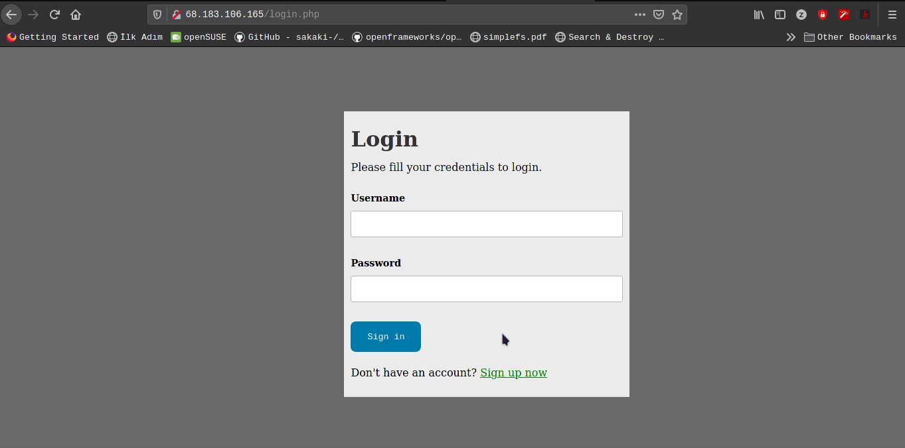

# mysqlogin

A simple login and log up application written in PHP. That uses MySQL queries and server connection.

..Note: Flutter side is not actually worked in some situations. It needs a localhost database connection without any password security (neither native_sql_connection nor chipher_sha2_secure). So I rewrite them up in PHP as well.

## Installation

I use my own server to develop this project. You can preview it on [with clicking.](http://68.183.106.165)

I developed it onto phpstorm, served using LAMP and phpmyadmin.
If you dont know how to install LAMP server look at my post about it on dev.to [from here](https://dev.to/zaryob/lamp-server-kurulumu-3na2)

Lets import database 

### Importing Database

#### phpmyadmin
Put all files with `*.php` extension and `css/` directory on `/var/www/html` directory.

Open the phpadmin.
 
Add new database from left side of the page
  
Put name as new database `users` then click `Create`
  
Select `users` database name left of the databases. An then click `Import` from tab

In this page you will import database with sql file provided with this project
Click to browse
 
Find sql file fith explorer.
  
Scroll down and click to go.
 
It will open a page and this page give lots of successfull output.


#### From manual

If you dont have any information about the phpmyadmin you can import it manually. Firstly create a database into your mysql. Lets open mysql from console:

```
mysql
```
Then create a database named `users` from here.
```
CREATE DATABASE users;
```
Then say exit to mysql shell and  import file from console

```
mysql -u username -p users < sql/auth.sql
```

### Installing Files

If this step is done, open `/var/www/html` directory and fix your `config.php` file.

`config.php` is generation codes of yout server.

In my side my server is `http://68.183.106.165/` my database host is `127.0.0.1` my database is `users` my database username is `admin` and password is `admin` config.php file should look like that:

```php
<?php
   $link = "http://68.183.106.165/";
   $host = '127.0.0.1'; 
   $database = 'users';
   $username = 'admin'; 
   $password = 'admin';
?>
```

.. Note: Don't forget `/` character at the end of the link.
.. Note: Dont use `localhost`. Use `127.0.0.1` instead of `localhost`

And your server is ready. 
 


#  DDL Codes

```sql
-- phpMyAdmin SQL Dump
-- version 5.0.4
-- https://www.phpmyadmin.net/
--
-- Host: mysql
-- Generation Time: Apr 26, 2021 at 09:29 PM
-- Server version: 10.5.8-MariaDB-1:10.5.8+maria~focal
-- PHP Version: 7.2.34

SET SQL_MODE = "NO_AUTO_VALUE_ON_ZERO";
START TRANSACTION;
SET time_zone = "+00:00";


/*!40101 SET @OLD_CHARACTER_SET_CLIENT=@@CHARACTER_SET_CLIENT */;
/*!40101 SET @OLD_CHARACTER_SET_RESULTS=@@CHARACTER_SET_RESULTS */;
/*!40101 SET @OLD_COLLATION_CONNECTION=@@COLLATION_CONNECTION */;
/*!40101 SET NAMES utf8mb4 */;

--
-- Database: `users`
--

-- --------------------------------------------------------

--
-- Table structure for table `users`
--

CREATE TABLE `users` (
  `id` int(11) NOT NULL,
  `username` varchar(255) NOT NULL,
  `password` varchar(255) NOT NULL
) ENGINE=InnoDB DEFAULT CHARSET=utf8mb4;

--
-- Dumping data for table `users`
--

INSERT INTO `users` (`id`, `username`, `password`) VALUES
(1, 'suleyman', 'poyraz'),
(2, 'deneme', '827ccb0eea8a706c4c34a16891f84e7b'),
(3, 'ray', 'malifalitiko');

--
-- Indexes for dumped tables
--

--
-- Indexes for table `users`
--
ALTER TABLE `users`
  ADD PRIMARY KEY (`id`),
  ADD UNIQUE KEY `id` (`id`);

--
-- AUTO_INCREMENT for dumped tables
--

--
-- AUTO_INCREMENT for table `users`
--
ALTER TABLE `users`
  MODIFY `id` int(11) NOT NULL AUTO_INCREMENT, AUTO_INCREMENT=4;
COMMIT;

/*!40101 SET CHARACTER_SET_CLIENT=@OLD_CHARACTER_SET_CLIENT */;
/*!40101 SET CHARACTER_SET_RESULTS=@OLD_CHARACTER_SET_RESULTS */;
/*!40101 SET COLLATION_CONNECTION=@OLD_COLLATION_CONNECTION */;

```

# DML Codes

This queries used in PHP codes. Also you can found it on index.php file.


This shows all users with given `$user_id`
```sql
SELECT * FROM users WHERE id = $user_id
```
This shows all users with given `user_name`

```sql
SELECT * FROM users WHERE username = $user_name
```

This shows all user rows.
```sql
SELECT * FROM users
```

This creates new user with given `password` and `username` variables. ":username" and ":password" are php queries.

```sql
INSERT INTO users (username, password)
            VALUES (:username, :password)
```

This is changes user credentials where `user_id` is same with given parameter.":username", ":password", ":email",":address" and "phone_number" are php queries. '{$_COOKIE["user_id"]}' is also cookie for php.

```sql
UPDATE users SET username = :username, password = :password, email = :email, address = :address,  phone_number=:phone_number WHERE id = '{$_COOKIE["user_id"]}';
```